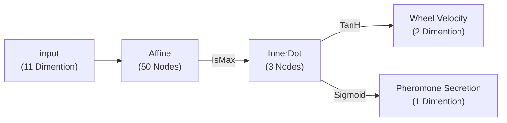

# 実験概要

　複数のロボットで餌を巣に運搬する．

# 実験目的

　協働採餌行動が取られるように学習させる設定を見つける．

# 実験内容

## 環境について

　巣，ロボット，障害物の配置については，巣の座標を(0,0)とし，ロボットは(-45,30)，餌は(0,700),(0,1200)，障害物は(0, 300)に配置する．

　餌の摩擦は次のようにした．

```xml
<geom (略) friction="0.5 0.0 0.0"/>
```

　餌の重さは2500gとする．これは2台以上でなければ動かせない重さである．

　大きさと形状について，餌には半径を$100\text{cm}$高さを$10\text{cm}$とした円柱，障害物は半径を$50\text{cm}$高さを$10\text{cm}$とした円柱とした．

　ロボットの構成は詳しく後述する．

## フェロモンの計算

　時刻tにおける座標$(x,y)$での気中に漂うフェロモンの量を$C^{(t)}_{(x,y)}$，地面に塗布された液体の量を$Q^{(t)}_{(x,y)}$とし次のように定める．$C^{(t)}_{(x,y)}$の第一項が蒸発項，第二項が拡散項，第三項が分解項となっている．

$$
\begin{align*}
\frac{\partial}{\partial t} C^{(t)}_{(x,y)} &= S^{(t)}_{(x,y)} + D \left(
    \frac{\partial^2}{\partial x^2} C^{(t)}_{(x,y)}
    +\frac{\partial^2}{\partial y^2} C^{(t)}_{(x,y)}
\right) -\alpha C^{(t)}_{(x,y)}
\\
\frac{\partial}{\partial t} Q^{(t)}_{(x,y)} &= -S^{(t)}_{(x,y)}
\end{align*}
$$

　蒸発項$S$は次のように計算する．$\text{SV}$は飽和蒸気量を表す．

$$
S^{(t)}_{(x,y)} = \begin{cases}
    \beta \left( \text{SV} - C^{(t)}_{(x,y)} \right) & \text{if } Q^{(t)}_{(x,y)} \geq 0 \\
    0 & \text{otherwise}
\end{cases}
$$

　拡散項に拡散項に関わる二階偏微分については中心差分を用いて近似値を求める．

$$
\begin{align*}
\frac{\partial^2}{\partial x^2} C^{(t)}_{(x,y)} &\approx
    \frac{C^{(t)}_{(x+\Delta x,y)} -2C^{(t)}_{(x,y)} +C^{(t)}_{(x-\Delta x,y)}}{\Delta x^2}
\\
\frac{\partial^2}{\partial y^2} C^{(t)}_{(x,y)} &\approx
    \frac{C^{(t)}_{(x,y+\Delta y)} -2C^{(t)}_{(x,y)} +C^{(t)}_{(x,y-\Delta y)}}{\Delta y^2}
\end{align*}
$$

　フェロモンのパラメータは次のように定めた．

| $D$  | $\text{SV}$ | $\alpha$ | $\beta$ |
|:----:|:-----------:|:--------:|:-------:|
| 35.0 | 10.0        | 0.1      | 20.0    |

　またフェロモンを計算するためにルンゲ＝クッタ法を用いた．このとき刻み幅は0.006666とし，1ステップごとの時間に一致するよう1ステップの計算の間に5回繰り返し計算する．

## ロボットの構成

### 物理的構造

　ロボットは背の低い円柱を胴体に持ち，前後に摩擦抵抗のない球体と左右に車輪として円柱を持たせる．

　ロボットの胴体は直径35cm，高さ10cm．球体は直径3cm．車輪は高さ10cm，直径が10cmの円柱とする．

　ロボットを構成するジオメトリの密度は，胴体を$0.51995\text{g}/\text{cm}^3$，車輪を$0.3\text{g}/\text{cm}^3$とする．

### 全方位センサ

　ロボットには全方位センサを複数持たせる．上から見てロボットを極とした$i$番目の観測対象の動径を$d^{(i)}$,偏角を$\theta^{(i)}$とし感度を$d_{1/3}$とすると全方位センサ$S_{\text{omni}}$は次のようになる．

$$
S_{\text{omni}} = \sum_i
\frac{1}
{
    \frac{2}{d_{\text{1/3}}}d^{(i)} + 1
}
\begin{bmatrix}
\sin \theta^{(i)} \\
\cos \theta^{(i)}
\end{bmatrix}
$$

また$d_{1/3}$はセンサの感度が$1/3$になる距離を表す．

　ロボットにはこの全方位センサを3つ搭載しており，それぞれ自身を除く他のロボットの検出，餌の検出，敵の検出を行う．$d_\text{1/3}$について他ロボットのセンサは100，障害物のセンサは150，餌のセンサは200とした．$d^{(i)}$は観測するロボットの中心と観測される物体の中心との距離であるため大きさを考慮するとどのセンサもロボットの中心から100cm離れたあたりで感度が$1/3$になる．100cmはおおよそロボット2台分である．

### 制御器

　ロボットの制御器にはニューラルネットワークを用いる．ニューラルネットワークの構造を次に示す．



　制御器の入力は，観測するロボットから見た巣の方向（2次），全方位センサによる他ロボットの知覚結果（2次），餌の知覚結果（2次），障害物の知覚結果（2次），現在地のフェロモンの量（1次）と勾配（2次）をconcatした11次のベクトルとなっている．

　車輪への出力は*Wheel Velocity*に10000がかけられたものを使う．フェロモンを分泌する量には*Pheromone Secretion*に30をかけたものを使う．

## 損失関数について

　損失関数は「ロボットから敵までの距離」から「敵から巣までの距離」を引いたものとする．ただし$\bold{F}$は餌の集合，$\bold{B}$はロボットの集合，$N_\bold{F}$は餌の数，$N_\bold{B}$はロボットの数，$\text{p}(\cdot)$を座標を返す関数，$\text{v}(\cdot)$を速度を返す関数とする．

$$
\begin{align*}
\text{L}_{\text{FN}} &= \frac{1}{N_\bold{F}} \sum_{f\in\bold{F}}
    \|f-\text{Nest}\|_2 \\

\text{L}_{\text{FB}} &= \frac{1}{N_\bold{F}N_\bold{B}}
    \sum_{f\in\bold{F}} \sum_{f\in\bold{B}}
    \exp \left(
        -\frac{
            {\|\text{p}(f)-\text{p}(b)\|_2}^2
        }{
            a_l\space\text{v}(f)+b_l
        }
    \right) \\

L &= \sum_t^{\text{timestep}} \left(
    0.001 \text{L}_{\text{FN}} - \text{L}_{\text{FB}} 
\right)
\end{align*}
$$

　速度の影響を調節するためのパラメータ$a_l, b_l$はそれぞれ$3.0\times10^5, 2.0\times10^4$とする．

## 最適化について

　最適化にはCMA-ESを用いる．
　本実験では実験「20221203_0249」で得られた最良個体のパラメータをCMAESの初期平均とする．

| 設定項目       |   値    |
|:----------:|:------:|
| generation | 3000世代 |
| lambda     | 100個体  |
| mu         |   10   |
| sigma      |  0.3   |
| エピソードの長さ   |  10秒   |

# 実験結果

　未記述

# 補足

## ソースコード

ソースコードはGitのハッシュ値が「f894504e」のものを使用した．
