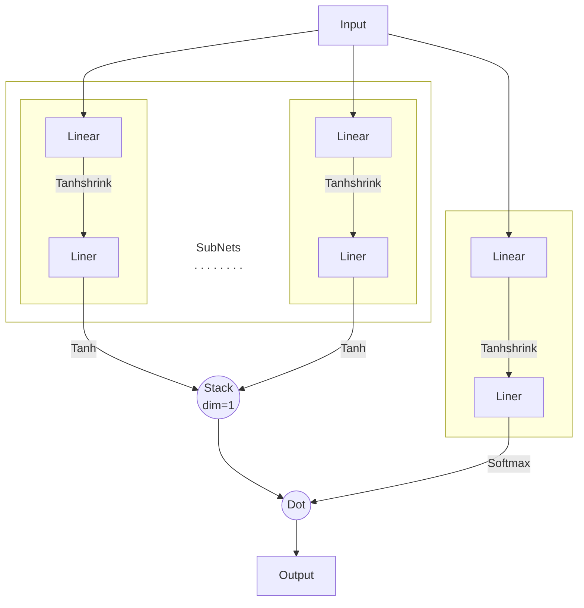

# multi net

We create a neural network composed of multiple sub-networks, each of which is a simple neural network.

The output of each sub-network is selected by a gating network.

Actual networks are shown in the following figure.

